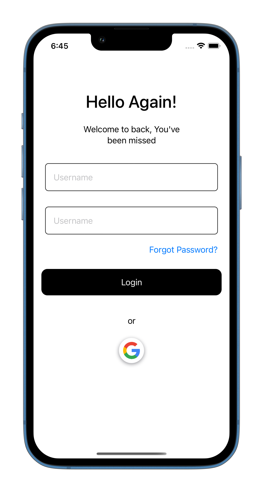
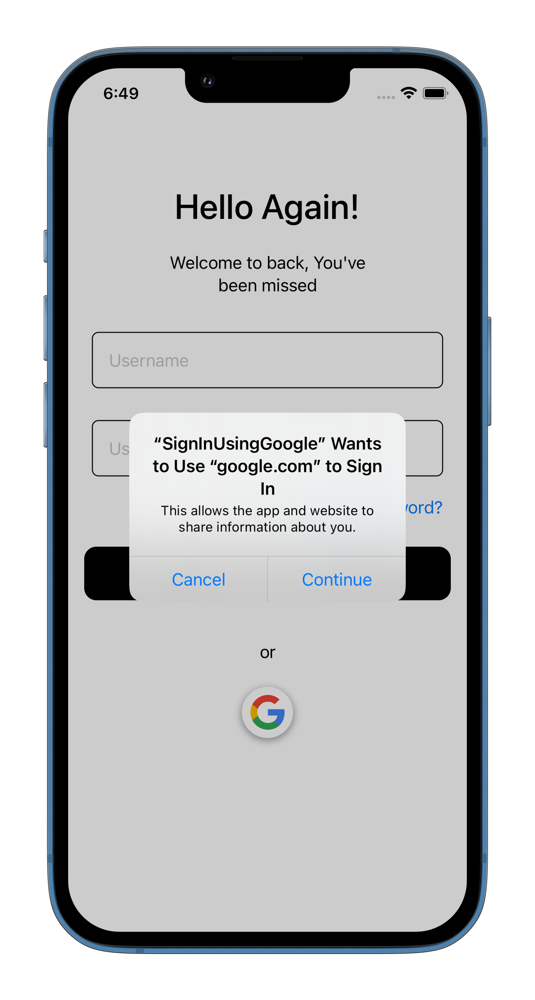
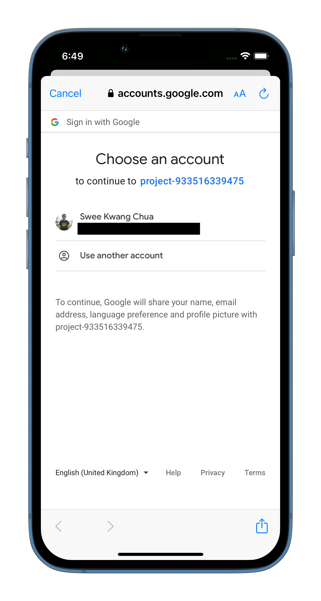

<a href="https://www.youtube.com/@weschua?sub_confirmation=1">

</a>

# How to setup Firebase Google Sign In with SwiftUI? (Update for Version 7)

[](https://youtu.be/M5LiqOBDeGg)

This repo provide you with the complete setup of Firebase google sign in with SwiftUI as the <a href="https://firebase.google.com/docs/auth/ios/google-signin">Official Docuementation</a> step is used for UIKit as example and missed out some key steps that is required for SwiftUI implementation. You can also watch the following video on <a href="https://www.youtube.com/watch?v=M5LiqOBDeGg">YouTube</a> which will also provide you with step by step guide on how to step up this.

## What will you be building

You will be building the functionality to login use Goole. Below is the screen.
<p>



</p>


#### Setup for Completed project
If you are planning to try out my <a href="https://github.com/WesCSK/SwiftUI-Google-Sign-In-with-Firebase/tree/main/Completed/FirebaseGoogleSigin">completed project</a>, do follow these additional steps before running it.
1. Create a Firebase new project and add the GoogleService-Info to the root of your Project.
2. Change the custom URL schemes in the Xcode project. Select your project file > at targets ensure that your project is selected > Info tab > Open up URL Types change the URL Schemes. 

- To get the URL Schemes. Open up GoogleService-Info. Find the REVERSED_CLIENT_ID key and copy to the URL schemes.

3. At Firebase console, go to Authentication > click get started > At additional provider > Click Google > Click enable > Add the information required. Then Save.
4. Then you can run the project to try out the google sign in method.

## Step 1: Project Configuration
1. Create a Firebase new project and add the GoogleService-Info to the root of your Project.

2. In Xcode, with your app project open, navigate to File > Add Packages > enter the Firebase iOS SDK repository URL:
```
https://github.com/firebase/firebase-ios-sdk

```

2.2 Select FirebaseAuth
2.3 Add the follow package too. File > Add Packages > enter the Firebase iOS SDK repository URL:
```
https://github.com/google/GoogleSignIn-iOS
```

3. At Firebase console, go to Authentication > click get started > At additional provider > Click Google > Click enable > Add the information required. Then Save.

4. Add custom URL schemes to your Xcode project. Select your project file > at targets ensure that your project is selected > Info tab > Open up URL Types > Click on Add. You need to add in the URL Schemes. 

- To get the URL Schemes. Open up GoogleService-Info. Find the REVERSED_CLIENT_ID key and copy to the URL schemes.

## Step 2: Code Implementation.
1. Create a AppDelegate File

   - File > New > File > Swift File > Save as AppDelegate
   - Create a new AppDelegate class to conform to NSObject and UIApplicationDelegate
 
```
import UIKit
class AppDelegate: NSObject, UIApplicationDelegate {

}
```

2. In your app delegate, implement `application:didFinishLaunchingWithOptions: method`, configure the FirebaseApp object. Remeber to import `FirebaseCore` and `GoogleSignIn`.
```
import UIKit
import Firebase
import GoogleSignIn

class AppDelegate: NSObject, UIApplicationDelegate {
    func application(_ application: UIApplication, didFinishLaunchingWithOptions launchOptions: [UIApplication.LaunchOptionsKey : Any]? = nil) -> Bool {
        FirebaseApp.configure()
        return true
    }
}
```

3. Implement the application:openURL:options: method of your app delegate. The method should call the handleURL method of the GIDSignIn instance, which will properly handle the URL that your application receives at the end of the authentication process.
```
class AppDelegate: NSObject, UIApplicationDelegate {
    ...
    
    @available(iOS 9.0, *)
    func application(_ application: UIApplication, open url: URL,
                     options: [UIApplication.OpenURLOptionsKey: Any])
      -> Bool {
      return GIDSignIn.sharedInstance.handle(url)
    }
}

```

4. Implement `UIApplicationDelegateAdaptor` property wrapper in your main App so that SwiftUI knows to create and manage your app delegate class.
```
@main
struct Your_ExampleApp: App {
    @UIApplicationDelegateAdaptor(AppDelegate.self) var appDelegate
    
    var body: some Scene {
        WindowGroup {
            Login()
        }
    }
}
```

5. Create a UIViewController so that it can pass the presenting view controller to the Google Sign In sign-in method.
```
extension View {
    func getRootViewController() -> UIViewController {
        guard let screen = UIApplication.shared.connectedScenes.first as? UIWindowScene else {
            return .init()
        }

        guard let root = screen.windows.first?.rootViewController else {
            return .init()
        }
        

        return root
    }
}

```

### Updated steps for v7.0.0 of Google Signin

6. Pass the presenting view controller and client ID for your app to the Google Sign In sign-in method and create a Firebase auth credential from the resulting Google auth token:

```
guard let clientID = FirebaseApp.app()?.options.clientID else { return }
        
let config = GIDConfiguration(clientID: clientID)

GIDSignIn.sharedInstance.configuration = config
        
GIDSignIn.sharedInstance.signIn(withPresenting: view.getRootViewController()) { signResult, error in
            
    if let error = error {
       ...
       return
    }
            
     guard let user = signResult?.user,
           let idToken = user.idToken else { return }
     
     let accessToken = user.accessToken
            
     let credential = GoogleAuthProvider.credential(withIDToken: idToken.tokenString, accessToken: accessToken.tokenString)

    // Use the credential to authenticate with Firebase

}

```

7. Authenticate with Firebase
```
Auth.auth().signIn(with: credential) { authResult, error in

}
```
